# Tecnológico de Software
## Materia: Arquitectura de software
- **Nombre:** Astrit Airan Cetzal Cetzal
- **Grupo:** A
- **Cuatrimestre:** Tercer Cuatrimestre
- **Carrera:** TSU en Desarrollo e Innovación de Software
- **Profesor:** Jorge Javier Pedrozo Romero

# Citas_App - Sistema de Gestión de Citas Médicas

## Descripción del Proyecto
Citas_App es un sistema de gestión desarrollado como proyecto académico para administrar la agenda de un consultorio o clínica. La aplicación permite llevar un registro ordenado de médicos, pacientes y las citas programadas entre ellos. El objetivo principal de este proyecto es demostrar la implementación del patrón arquitectónico MVC (Modelo-Vista-Controlador) y la persistencia de datos mediante archivos locales, asegurando una experiencia de usuario fluida y una estructura de código escalable.

## Cómo se construyó (Tecnologías)
Este proyecto fue desarrollado utilizando el ecosistema de Microsoft y tecnologías web estándar:

* **Backend:** C# con el framework ASP.NET Core MVC.
* **Frontend:** Vistas generadas con Razor (HTML5) y estilizadas con CSS3 puro, implementando una paleta de colores personalizada basada en tonos azul acero para transmitir profesionalismo y limpieza.
* **Persistencia de Datos:** Almacenamiento local utilizando archivos de texto en formato JSON. Se implementó el patrón Repositorio (Repository Pattern) junto con interfaces (`ICitaRepository`, `IMedicoRepository`, `IPacienteRepository`) y procesos de serialización/deserialización para gestionar la lectura y escritura de datos.
* **Arquitectura:** Separación clara de responsabilidades entre Controladores, Modelos (incluyendo DTOs como `CitaJson`), Vistas y Repositorios.

## Funcionalidades Implementadas
El sistema cuenta con las siguientes capacidades operativas:

* **Gestión de Pacientes:** Visualización del listado completo, consulta de detalles individuales (perfil) y registro de nuevos pacientes con autoincremento de ID.
* **Gestión de Médicos:** Visualización del directorio médico, consulta de detalles por especialista y registro de nuevo personal médico.
* **Gestión de Citas:**  Visualización de la agenda general con cruce de datos (nombre del paciente y nombre del médico).
    * Filtrado específico para visualizar únicamente el historial de citas de un paciente determinado.
    * Registro de nuevas citas utilizando menús desplegables dinámicos que se alimentan de los datos de pacientes y médicos existentes para evitar errores de captura.

## Capturas de pantalla

**Página Principal (Inicio)**

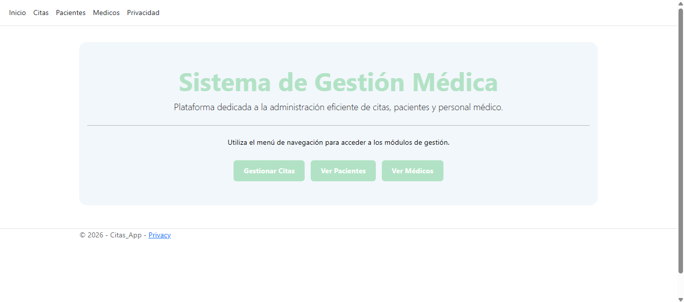

**Citas**
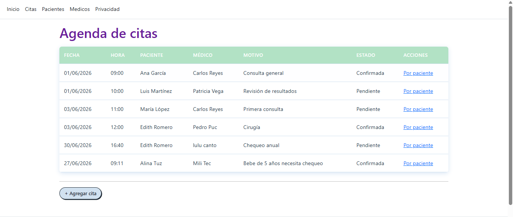
**Detalle por paciente**
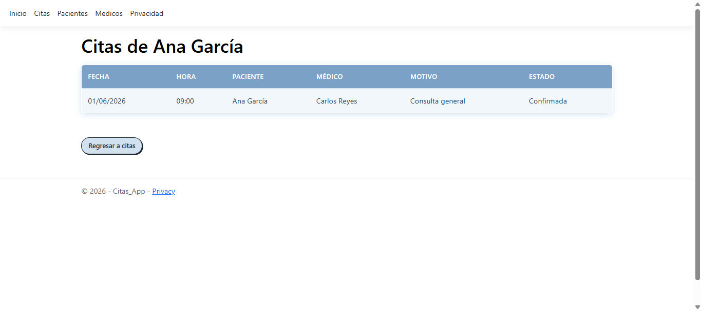
**Agregar cita**

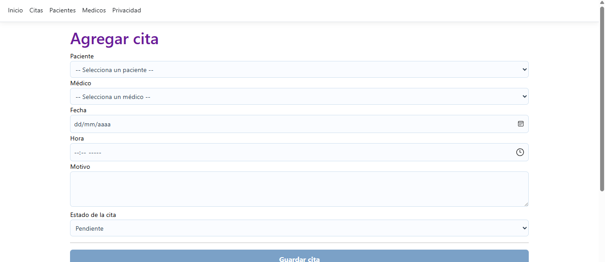

**Pacientes**
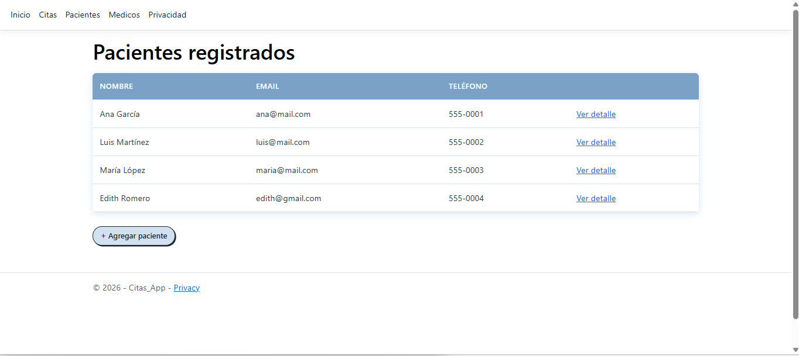
**Detalle Paciente**
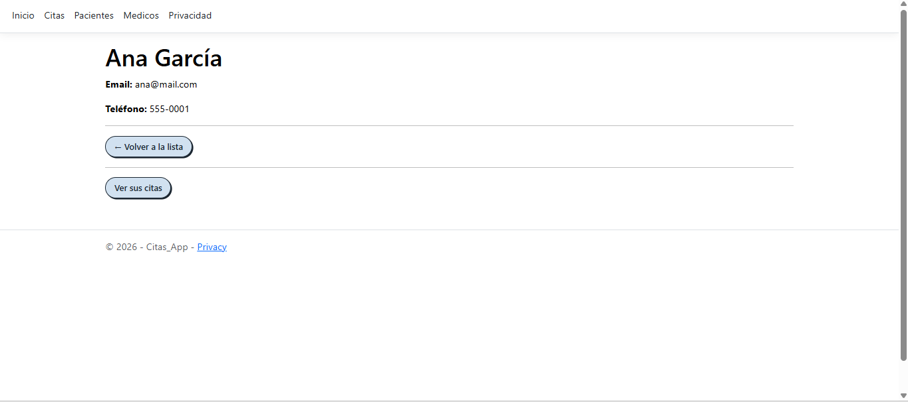
**Agregar Pacientes**
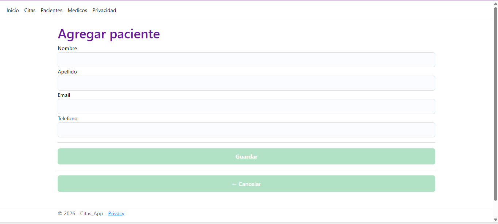

**Médicos**
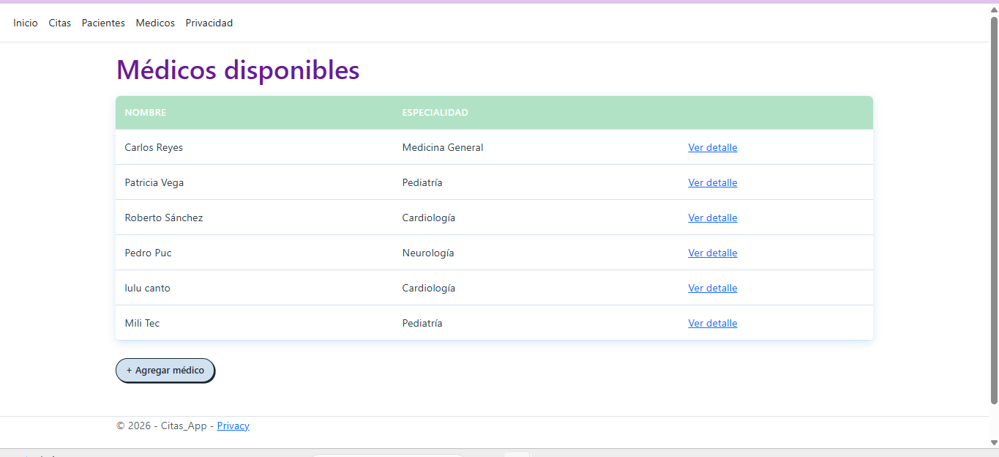
**Detalle Médicos**
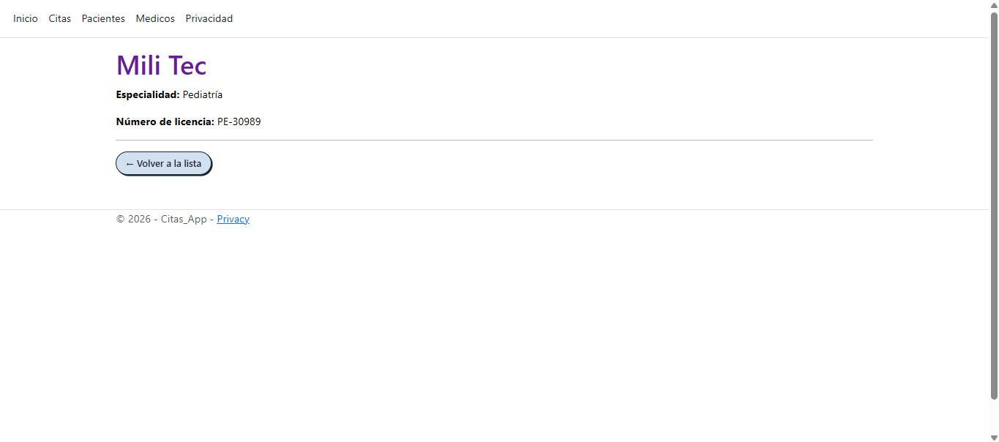
**Agregar Médicos**
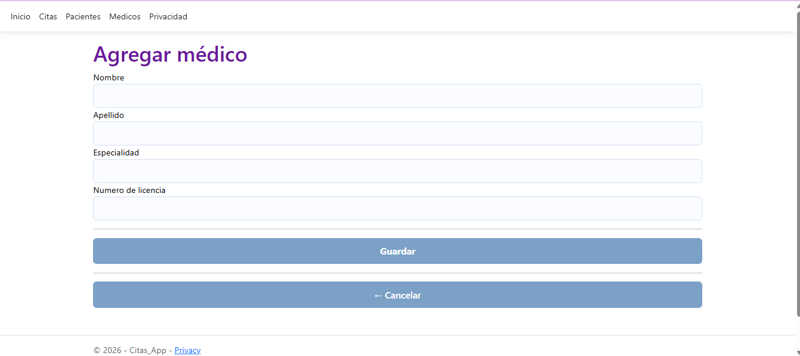

**Privacidad**
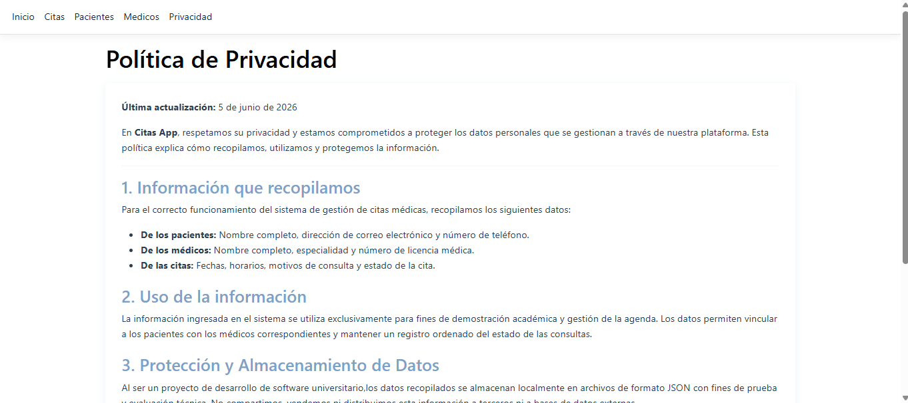
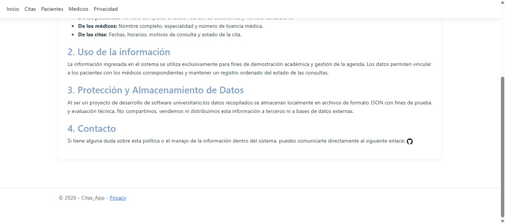

## Declaración de uso de IA
Para el desarrollo de este proyecto se utilizaron herramientas de Inteligencia Artificial como asistentes de programación bajo un enfoque de copilotaje. El uso de la IA se limitó estrictamente a:
* Verificación lógica y depuración de errores de enrutamiento y paso de parámetros entre vistas y controladores.
* Asistencia en la estructuración de reglas CSS para la alineación y el diseño visual de las tablas y formularios.
* Resolución de dudas conceptuales sobre arquitectura de software (como la diferencia entre repositorios y listas, y el uso de la serialización JSON).
Toda la lógica base, la estructura del proyecto y la integración de los componentes fue analizada, comprendida y dirigida manualmente para garantizar el aprendizaje y dominio de los conceptos de ingeniería de software aplicados.

## Agradecimientos

- **Profesor Jorge Javier Pedrozo Romero** por el apoyo constante y la guía durante el desarrollo de la materia.

---
## Contacto

- **Email Institucional:** [astrit.cetzal@tecdesoftware.edu.mx]
- **GitHub:** [astritcetzal](https://github.com/astritcetzal)
  
---

## Derechos de Autor (Copyright)

---

**⭐ Si te gustó este proyecto, dale una estrella ⭐**

Hecho con 💗 por **Astrit Cetzal** - 2026

