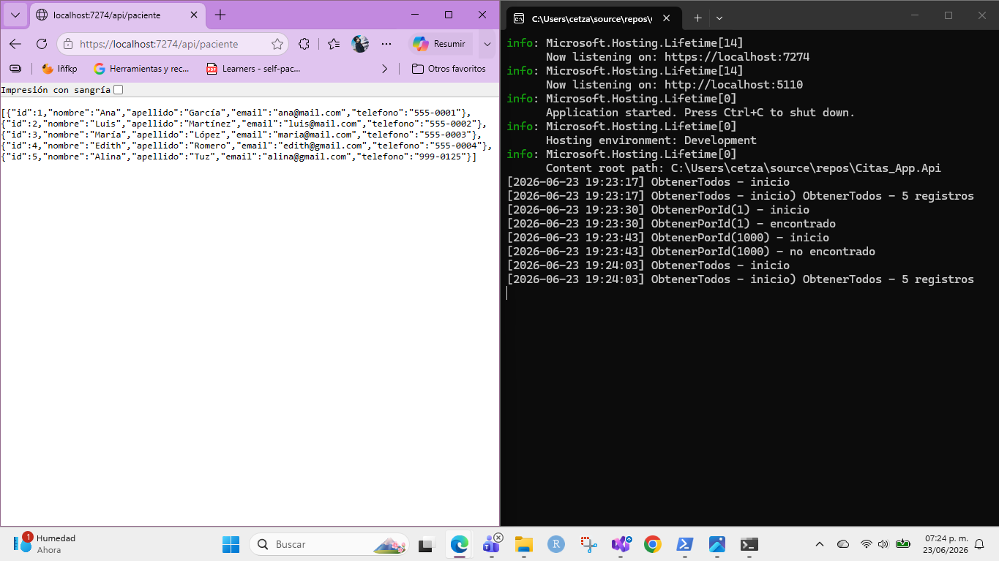
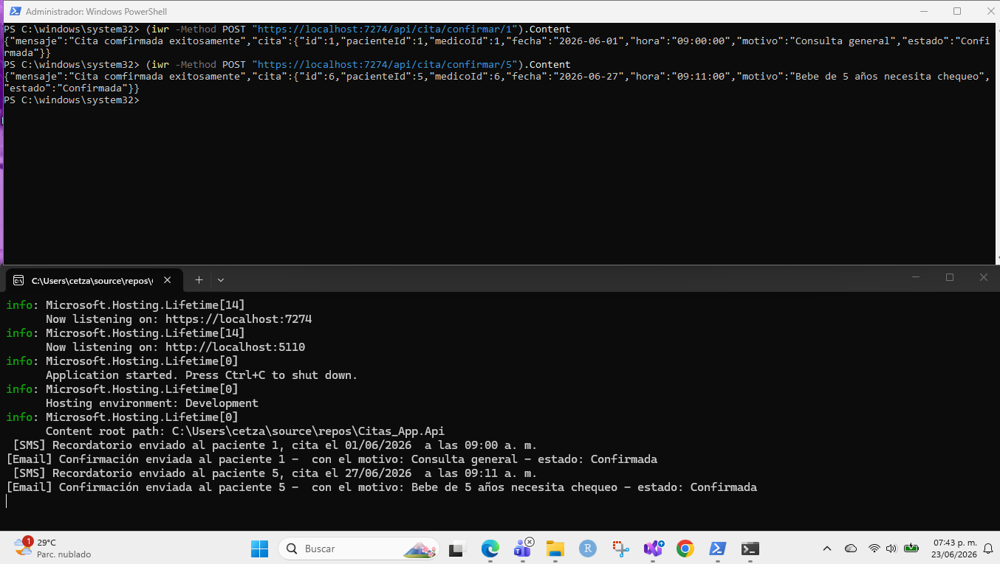

# Tecnológico de Software
## Materia: Arquitectura de software
- **Nombre:** Astrit Airan Cetzal Cetzal
- **Grupo:** A
- **Cuatrimestre:** Tercer Cuatrimestre
- **Carrera:** TSU en Desarrollo e Innovación de Software
- **Profesor:** Jorge Javier Pedrozo Romero

---

App de citas médicas construida con ASP.NET Core (.NET 10).

## 🛠️ Tecnologías y Herramientas Utilizadas


---

## Arquitectura
Hexagonal (Ports & Adapters) dividida en cinco proyectos:

- **CitasApp.Domain** — modelos e interfaces (sin dependencias externas)
- **CitasApp.Application** — servicios de aplicación (orquesta el Domain)
- **CitasApp.Infrastructure** — repositorios JSON y en memoria
- **CitasApp.Web** — cliente MVC para navegador
- **CitasApp.Api** — cliente API REST para cualquier dispositivo
- **CitasApp.xUnit** — Capa dedicada a las pruebas unitarias automáticas.

## Flujo de dependencias
```
Web  → Application → Domain ← Infrastructure
Api  → Application → Domain ← Infrastructure
````
## Entidades
- **Paciente** — lista y detalle de pacientes registrados
- **Médico** — lista y detalle de médicos disponibles
- **Cita** — agenda completa y filtro por paciente

## Persistencia
Archivos JSON en `data/` dentro de cada proyecto cliente.

## Endpoints API REST
- `GET /api/paciente` — lista de pacientes
- `GET /api/paciente/{id}` — detalle de un paciente
- `GET /api/medico` — lista de médicos
- `GET /api/medico/{id}` — detalle de un médico
- `GET /api/cita` — agenda completa
- `GET /api/cita/porpaciente/{pacienteId}` — citas de un paciente
- `POST /api/cita/confirmar/{citaId}` — confirma una cita y dispara notificaciones

## Navegación Web (MVC)
- `/Paciente` — lista de pacientes
- `/Medico` — lista de médicos
- `/Cita` — agenda completa
- `/Cita/PorPaciente?pacienteId=1` — citas de un paciente

## Patrones GOF implementados

- **Factory** (`RepositoryFactory`) — selecciona el repositorio según el entorno (Development → JSON, Production → Memoria)
- **Decorator** (`LoggingPacienteRepository`) — agrega logging con timestamp sin modificar el repositorio original
- **Observer** (`SmsObserver`, `EmailObserver`) — notifican automáticamente al confirmar una cita sin acoplar CitaService a los canales de notificación

## Deuda técnica

### ¿Qué es?
Actualmente la persistencia de datos de CitasApp se basa en archivos JSON locales gestionados por repositorios de infraestructura. Se trata de una implementación de persistencia "en memoria/archivo" que carece de las capacidades transaccionales, de integridad relacional y de escalabilidad propias de un motor de bases de datos relacional.

### ¿Por qué existe? 
Es una decisión consciente adoptada en las fases iniciales del proyecto para maximizar la velocidad de desarrollo, simplificar la portabilidad y evitar la sobrecarga de configurar un servidor de bases de datos durante el diseño de la arquitectura hexagonal. Se prefirió validar la lógica de negocio antes que la infraestructura de datos. 

### Costo de no pagarla:
Si el sistema crece en número de usuarios o citas, el uso de archivos JSON presentará graves problemas de consistencia y rendimiento:
- **Riesgo de corrupción**: Ante una escritura simultánea (dos usuarios agregando citas al mismo tiempo), el archivo JSON podría corromperse o perder información.
- **Escalabilidad**: Al no tener un motor de consultas (SQL), el tiempo de lectura/escritura crecerá de forma lineal o peor conforme el archivo aumente de tamaño, haciendo que el sistema sea lento e ineficiente.
- **Integridad**: No existen restricciones que aseguren que un paciente o médico realmente exista antes de asignar una cita.

### Propuesta de solución:
La solución consiste en migrar la capa de infraestructura a un motor SQLite mediante la implementación de Entity Framework Core (EF Core).

- **Técnica de refactorización**: Aplicar el patrón Repository Pattern creando un nuevo `SQLiteCitaRepository` que implemente las interfaces existentes.
- **Ventaja**: Gracias a la arquitectura hexagonal, el cambio será transparente; solo se requiere actualizar el registro de servicios en `Program.cs`, sin necesidad de modificar el CitaService ni los controladores, preservando intacta la lógica de negocio.

## ⬇️ Entra al siguiente enlace para ver el diagrama UML de la arquitectura del sistema:

➡️ [Haz clic aquí para ver el Diagrama de Clases](Citas_App/docs/diagrama.md)





## Proceso de Desarrollo y Resolución de Retos

Durante la construcción e integración de este sistema, se llevaron a cabo los siguientes hitos de ingeniería:

1. **Migración a SQLite:** Transición desde almacenamiento plano (JSON/CSV) hacia un motor relacional robusto con SQLite, centralizando la persistencia mediante Entity Framework Core y gestionando la seguridad con ASP.NET Core Identity.
2. **Implementación de Patrones:** 
   * **Factory Method & Decorator:** Creación y envoltorio de repositorios para auditoría y registro de actividad (*Logging*).
   * **Observer:** Notificaciones desacopladas para eventos de citas.
3. **Pruebas Unitarias y Fakes:** Desarrollo de adaptadores en memoria (*Fakes*) para simular repositorios sin comprometer la base de datos real durante la ejecución de pruebas con `xUnit`.
4. **Automatización e Integración Continua (CI/CD):** 
   * Configuración de un pipeline automatizado con **GitHub Actions** (`ci.yml`).
   * Resolución de la estructura de directorios en la raíz del repositorio para asegurar la correcta restauración de dependencias (`dotnet restore`), compilación (`dotnet build`) y ejecución exitosa de pruebas (`dotnet test`) en entornos basados en Linux (Ubuntu).

---

## Requisitos
- .NET 10.0
- Visual Studio 2022

## Ramas
- `main` — estado evaluable con persistencia JSON en un solo proyecto
- `hexagonal` — arquitectura hexagonal multi-proyecto con capa de aplicación
- `Api` — API REST expuesta como segundo cliente del núcleo de negocio
- `GOF` — Implementación de patrones GOF
- `UML` — Incluye los diagramas como código
- `CodeSmells` — Se identificaron los code smells y se plantea la deuda técnica
- `CI/CD` — Configuración de un pipeline automatizado con GitHub Actions

## Contacto

- **Email Institucional:** [astrit.cetzal@tecdesoftware.edu.mx]
- **GitHub:** [astritcetzal](https://github.com/astritcetzal)

---

## Derechos de Autor (Copyright)
Este proyecto es de código abierto y se distribuye con fines estrictamente académicos y educativos. Se concede permiso de manera gratuita a cualquier persona que obtenga una copia de este software para utilizarlo, modificarlo, compilarlo y distribuirlo sin restricciones, con el objetivo de fomentar el aprendizaje, la investigación y el desarrollo de competencias en arquitectura de software.

---

## Clausula de IA

Declaro el uso de inteligencia artificial de manera asistida para estructurar mejor la idea de la deuda técnica, así como de la implementación de los code-smells, así como para el soporte en la resolución de incidencias de integración continua (CI/CD) durante el desarrollo del proyecto.

---

<div align="center">

**⭐ Si te gustó este proyecto, dale una estrella ⭐**

Hecho con 💗 por **Astrit Cetzal** - 2026

</div>
